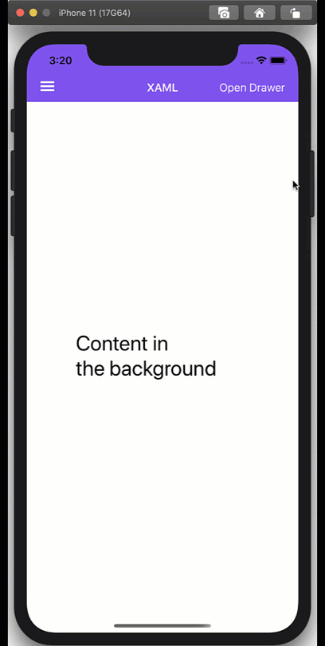

# Sample Bottom Drawer

Opens from the toolbar item. It may be closed via the backdrop tap, and by sliding it closed. Sliding it a little will result in springing back open.

> Currently seems there's an [iOS issue](https://github.com/xamarin/Xamarin.Forms/issues/11655) with the pan gesture and the SafeArea. I overcame it by disabling SafeArea.

